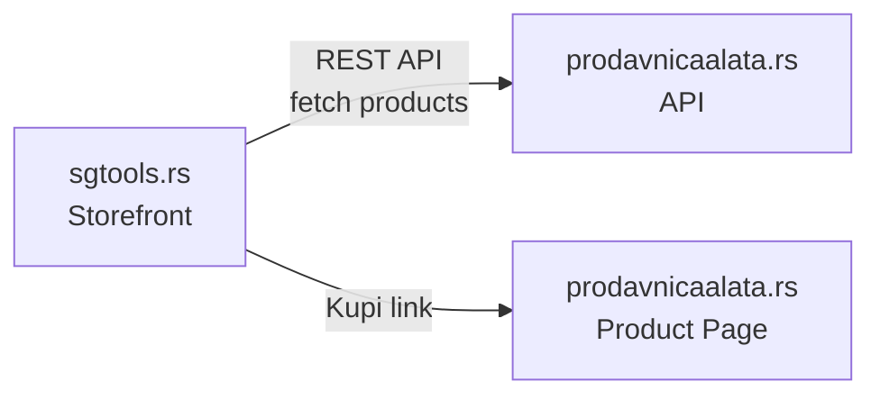

# SG Tools (sgtools.rs)

Marketing and product showcase site for the SG Tools brand by Stridon Group DOO.

## Tech Stack

- **Next.js 16** (App Router) + TypeScript
- **Tailwind CSS v4** with OKLCH color tokens
- **Deployed on Vercel**

## Architecture



SG Tools products are fetched server-side from the prodavnicaalata.rs REST API and displayed on sgtools.rs. Each product page links to prodavnicaalata.rs for purchasing — this site has no cart or checkout.

## Getting Started

All commands run from the `storefront/` directory:

```bash
npm run dev      # Start dev server (localhost:3000)
npm run build    # Production build
npm run start    # Start production server
npm run lint     # Run ESLint
```

## Domain Map

| Domain                 | Purpose                                |
| ---------------------- | -------------------------------------- |
| **sgtools.rs**         | This project — SG Tools brand site     |
| **stridon.rs**         | Parent company (Stridon Group DOO)     |
| **prodavnicaalata.rs** | Online shop — where users buy products |
